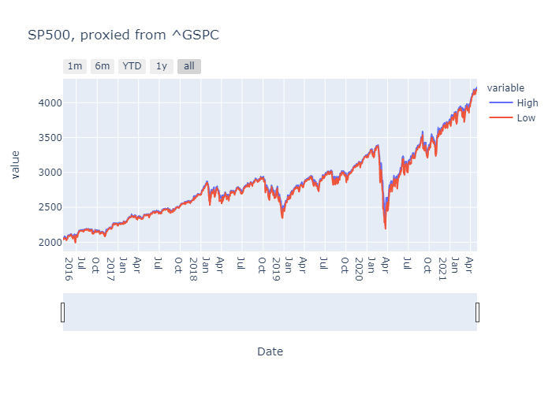

# How to hedge on COVID-19

Pandemia happened in the very end of 2019 has changed contemporary way of life of billions of people. Coronavirus has influenced on not only the lives of the people, but also to the life of companies, where they work. It is said there is no company, which business cycle has not at least some how changed due to the Pandemia. Some companies can adopt to the new reality and some do not.

This may be one of the reasons, why investors started to react to the information about the spread of the plague, by rebalancing their own portfolios.

From the graph below we can, see that  
